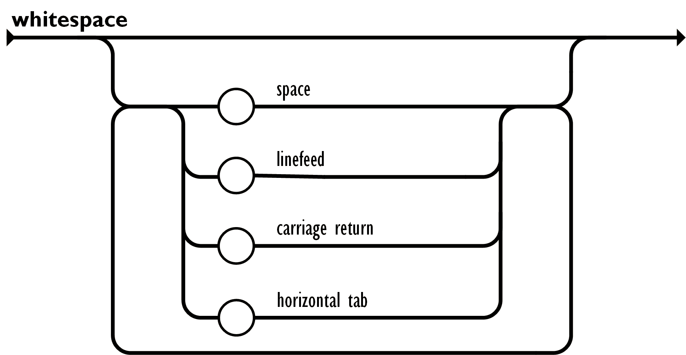

# JSONC

`JSONC` is a lightweight implementation of `JSON` Data Interchance Standard for `C++` programming language.

It is an ideal candidate to use with microcontrollers. The library was tested with [`Raspberry Pi Pico and Pico W`](https://www.raspberrypi.com/documentation/microcontrollers/raspberry-pi-pico.html).

`JSON` + `C++` = ❤️

## Add dependency

### CMake

`CMake` provides a convenient way to depend on the library.

```cmake
include(FetchContent)

FetchContent_Declare(
  JSONC
  GIT_REPOSITORY git@github.com:st235/JSONC.git
  GIT_TAG "main"
  GIT_SHALLOW TRUE
  GIT_PROGRESS ON
)
FetchContent_MakeAvailable(JSONC)

target_link_libraries(your-project-target jsonc)
```

See more in [`sample`](./sample/)

## Exploring the API

### Create Json Object

```cpp
#include "json.h"

...

const auto& json_value = json::FromJson(json_string);
```


## Json Grammar Rules

The specification of JSON format is available at [_the oficial website_](https://www.json.org/json-en.html) or as [_ECMA-404 The JSON Data Interchange Standard_](https://ecma-international.org/publications-and-standards/standards/ecma-404/).

The grammar specifies 6 entries: `array`, `number`, `object`, `string`, `value`, and `whitespace`.
`value` is the entry point.

I won't cover all the details of the implemention but will provide the most important grammar rules.

| Array | Number | Object |
| ----- | ----- | ----- |
|  |  |  |

| String | Value | Whitespace |
| ----- | ----- | ----- |
|  |  |  |

## Contribution

The project is using `CMake` as the build system.

### Building

Use these commands to build the project:

```bash
mkdir build
cmake ..
make
```

### Running test

A lot of logic in the library heavily relies on _unit_ and _integration_ tests.
To run them you need yo _successfully build the project_ and run the command below:

```bash
ctest --output-on-failure
```
